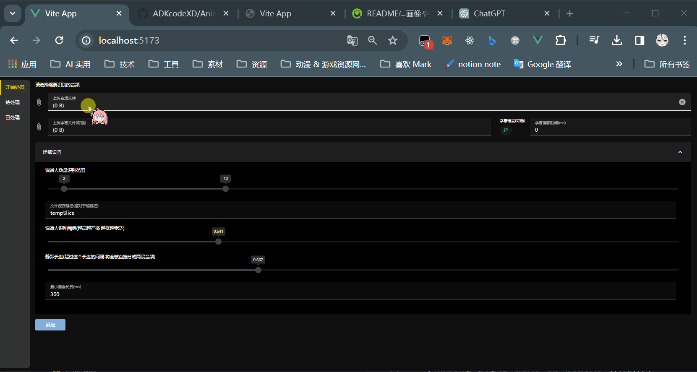

# Anime Audio DataSet Maker 

- [English README](README.md)
- [中文说明](README_zh.md)

## Introduce

此项目旨在为番剧提供一个快速高效提取角色音频的解决方案。

WEBUI下载链接：
<a href="https://github.com/ADKcodeXD/Anime-Audio-Dataset-Maker-WEBUI/releases">Anime-Audio-Dataset-Maker-WEBUI Release</a>

## Usage

- 第一步：确保您的系统安装了Python3。我们推荐使用高于Python 3.10的版本。
- 第二步：下载此仓库。
- 第三步：下载WEBUI，解压后，将 Web 文件夹放在此仓库的同一目录下。
- 最后一步：运行 launch.bat。pip安装完成后，如果没有端口冲突，网站应自动打开。

## How it work

- 通过pyannote.audio对原音频进行说话人的识别和切割
- 通过字幕时间线对原音频进行切割
- 通过匹配检测最佳匹配的说话人
- 分类到各个说话人的文件夹中

## WebUI操作流程

- 开始预处理音频

...

## Feature

- Support automaticly split long audio by each speaker
- Support sub upload and slice by sub timeline.
- Support edit the sub text and export it by bert-vits config
- Support split ever single audio (WebUI)
- Support merge audio with interval (WebUI)
- Support management folders or files (WebUI)
- Support use Arrow key to handle data (WebUI)
- Support batch rename (WebUI)
- Support batch move or remove (WebUI)

